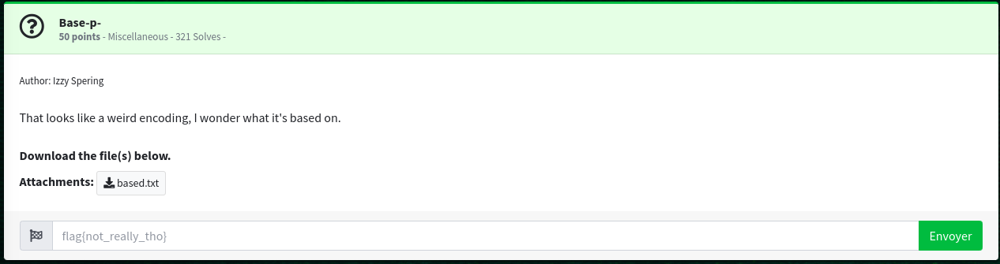
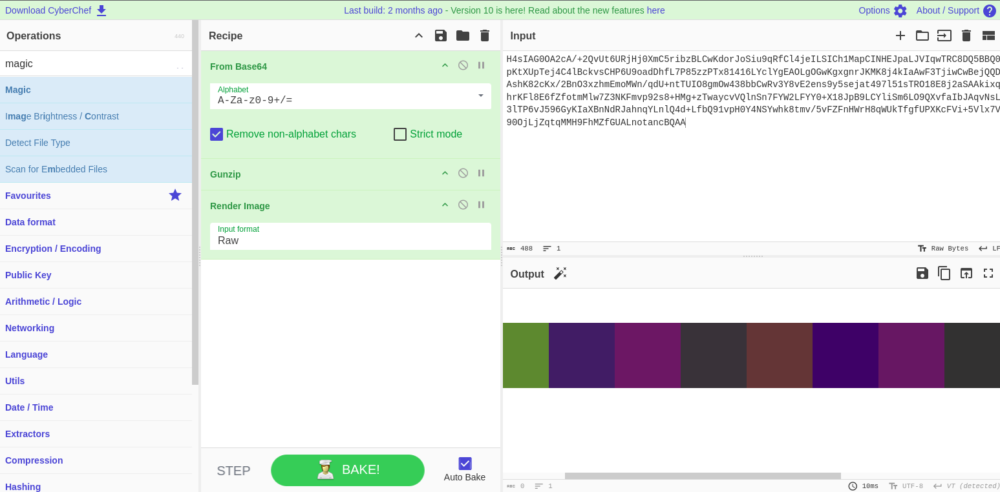
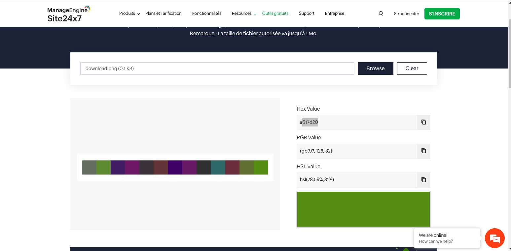
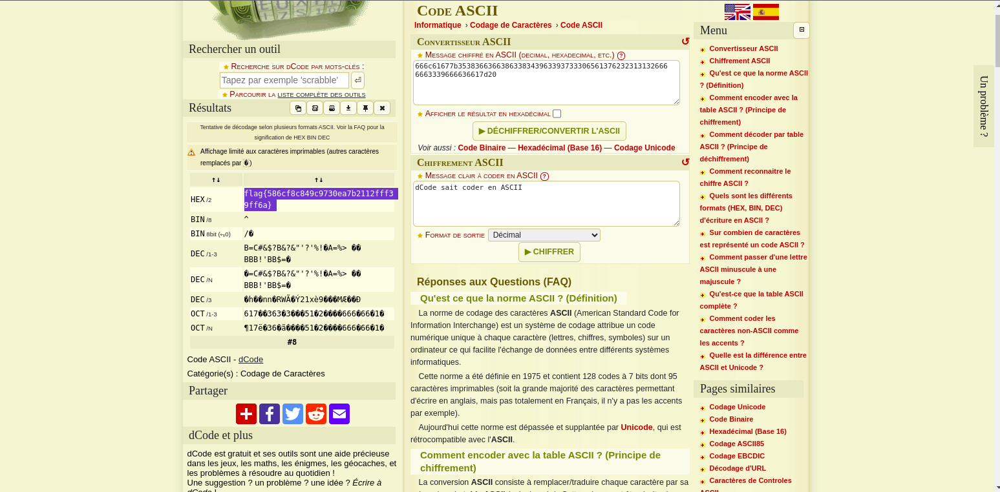

En ouvrant le fichier on obtient des caractères qui ressemble à des symboles chinois

```bash
楈繳籁萰杁癣怯蘲詶歴蝕絪敪ꕘ橃鹲𠁢腂𔕃饋𓁯𒁊鹓湵蝱硦楬驪腉繓鵃舱𒅡繃絎罅陰罌繖𔕱蝔浃虄眵虂𒄰𓉋詘襰ꅥ破ꌴ顂𔑫硳蕈訶𒀹饡鵄腦蔷樸𠁺襐浸椱欱蹌ꍣ鱙癅腏葧𔕇鱋鱸𓁮聊聍ꄸꈴ陉𔕁框ꅔ𔕩𔕃驂虪祑𓅁聨朸聣摸眲葮𖠳鵺穭𒁭豍摮饱恕𓉮詔葉鰸葭楷洳面𔕃𔑒踳𔐸杅𐙥湳橹驳陪楴氹橬𓄱蝔晏稸ꄸ防癓ꉁ𖡩鵱聲ꍆ稸鬶魚𓉯艭𔕬輷茳筋𔑭湰𓄲怸艈恧襺陷项譶ꍑ衮汮蹆杗筌蹙怰晘缸睰脹蹃鹬ꕓ脶湏赑魶繡罢𒉁荶腳ꌳ蕔𔐶橊欹𖥇繋赡𐙂饎罒鵡𒉮腙ꍮ楑恤魌虢昹𒅶效楙衎𔕙ꉨ𓈸𔑭樯筶筚絮𓁗浈豱ꉕ魔魧蕕聘筣鹖樫ꍖ汸湖萰腪轪𓉱艱絍笹艨魚詇腁𒁮陴顮虂癁

```   
J'ai d'abord pensé à rot8000 mais c'était pas le cas. Place à google, avec un peu de recherche j'ai vu des articles qui mentionnaient que c'était encodé en base65536. 


```python 
import base65536

with open('based.txt','r') as f:
    ct = f.readline().rstrip().replace(' ','')

with open('output','wb') as f2:
    f2.write(base65536.decode(ct))
```

On obtient en sortie 

```bash 
H4sIAG0OA2cA/+2QvUt6URjHj0XmC5ribzBLCwKdorJoSiu9qRfCl4jeILSICh1MapCINHEJpaLJVIqwTRC8DQ5BBQ0pKtXUpTej4C4lBckvsCHP6U9oadDhfL7P85zzPTx81416LYclYgEAOLgOGwKgxgnrJKMK8j4kIaAwF3TjiwCwBejQQDAshK82cKx/2BnO3xzhmEmoMWn/qdU+ntTUIO8gmOw438bbCwRv3Y8vE2ens9y5sejat497l51sTRO18E8j2aSAAkixqhrKFl8E6fZfotmMlw7Z3NKFmvp92s8+HMg+zTwaycvVQlnSn7FYW2LFYY0+X18JpB9LCYliSm6LO9QXvfaIbJAqvNsL3lTP6vJ596GyKIaXBnNdRJahnqYLnlQ4d+LfbQ91vpH0Y4NSYwhk8tmv/5vFZFnHWrH8qWUkTfgfUPXKcFVi+5Vlx7V90OjLjZqtqMMH9FhMZfGUALnotancBQAA

```
J'ai ensuite utilisé l'outil magic de [Cyberchef](https://gchq.github.io/CyberChef/#recipe=From_Base64('A-Za-z0-9%2B/%3D',true,false)Gunzip()Render_Image('Raw')&oenc=65001&oeol=VT)



L'image obtenu comporte des couleurs, les codes de couleur ? C'est sûrement la première chose qui nous vient à l'esprit. Vous pouvez utilisez un outil en ligne pour obtenir les codes de chaque couleur 



Et justement une fois les codes de couleur rassemblé on obtient le flag 


##	flag{586cf8c849c9730ea7b2112fff39ff6a} 

