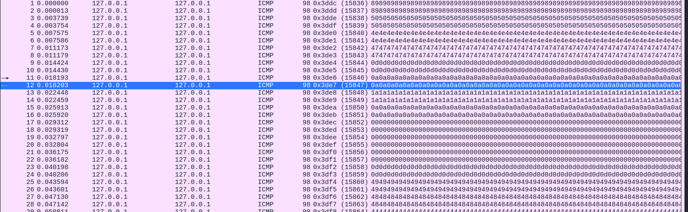

En ouvrant le fichier pcap dans Wireshark voici ce que l'on obtient 

Si vous pretez bien attention vous verrai que chaque paquet envoyé contient un octet d'une image png. 89 50 4e 47 ... sont les magiques bytes d'une image png. Une fois que nous avos une idée de ce que nous à faire il temps de préparer le script pour extraire les données.  

## J'ai utilisé trois scripts en tout pour la résolution. 

[Etape1](Etape1.py)
[Etape2](Etape2.py)
[Etape3](Etape3.py )

## Et vous obtenez le flag

