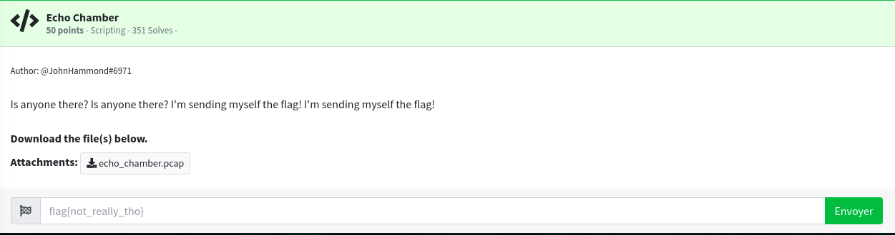

## Contexte
Le challenge portait sur l'analyse d'un fichier PCAP contenant des trames ICMP. Nous devions identifier un message caché.

## Étape 1: Analyse initiale
J'ai d'abord ouvert le fichier PCAP dans Wireshark.

## Étape 2: Extraction des trames ICMP
J'ai filtré les trames ICMP avec le filtre suivant : `icmp`.

## Étape 3: Analyse des identifiants ICMP
J'ai remarqué que les identifiants ICMP apparaissent deux fois de suite, indiquant potentiellement un message à décrypter.

## Résultat final
Après avoir décodé les identifiants, j'ai trouvé que le message caché était **"HELLO WORLD"**.

